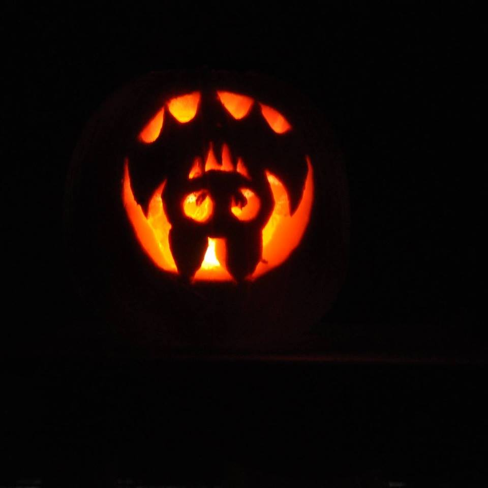

<!DOCTYPE html> 

<html>

<head> 
	
	
	
	
</head>

	
	
<body bgcolor="#00000"> 
<table align="centre" width=100% border=0>
    <tr>
    <td  >
        
        </td> 
        <td>
            <table align="centre" width=100% border=0>
                <tr align = "center">
                    <td>
                     
                     <a href="https://boraniev.github.io/bbqarch/model" > BBQ IoT architecture  <a>
                     
                    </td>
                </tr>
                <tr align = "center" >
                    <td >
                     
                    <a href="https://boraniev.github.io/clocks/binaryclock"> Binary Clock   </a>
                    </td>
            </table>
        </td>
      
        <td  >
        
        </td>
           
       
</tr>
</table>
		
	
</body>	

</html>

